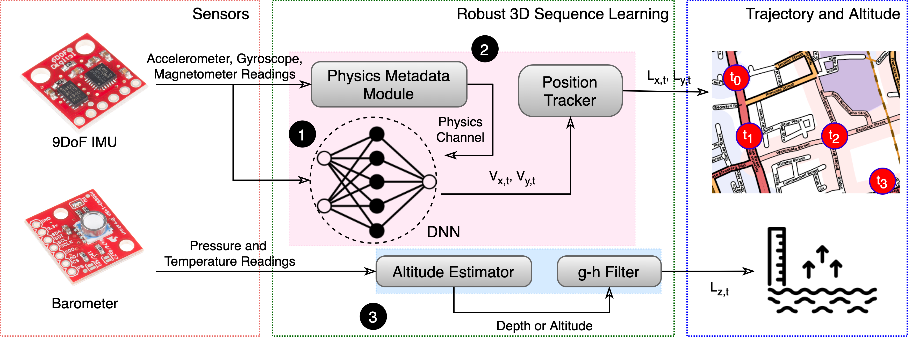

# TinyOdom: Hardware-Aware Efficient Neural Inertial Navigation




## Summary
Deep inertial sequence learning has shown promising odometric resolution over model-based approaches for trajectory estimation in GPS-denied environments. However, existing neural inertial dead-reckoning frameworks are not suitable for real-time deployment on ultra-resource-constrained (URC) devices due to substantial memory, power, and compute bounds. Current deep inertial odometry techniques also suffer from gravity pollution, high-frequency inertial disturbances, varying sensor orientation, heading rate singularity, and failure in altitude estimation. In this paper, we introduce TinyOdom, a framework for training and deploying neural inertial models on URC hardware. TinyOdom exploits hardware and quantization-aware Bayesian neural architecture search (NAS) and a temporal convolutional network (TCN) backbone to train lightweight models targetted towards URC devices. In addition, we propose a magnetometer, physics, and velocity-centric sequence learning formulation robust to preceding inertial perturbations. We also expand 2D sequence learning to 3D using a model-free barometric g-h filter robust to inertial and environmental variations. We evaluate TinyOdom for a wide spectrum of inertial odometry applications and target hardware against competing methods. Specifically, we consider four applications: pedestrian, animal, aerial, and underwater vehicle dead-reckoning. Across different applications, TinyOdom reduces the size of neural inertial models by 31x to 134x with 2.5m to 12m error in 60 seconds, enabling the direct deployment of models on URC devices while still maintaining or exceeding the localization resolution over the state-of-the-art. The proposed barometric filter tracks altitude within ±0.1m and is robust to inertial disturbances and ambient dynamics. Finally, our ablation study shows that the introduced magnetometer, physics, and velocity-centric sequence learning formulation significantly improve localization performance even with notably lightweight models.

## Code Architecture

There are seven folders in TinyOdom:
- ```OxIOD```, ```RoNIN```,  ```AQUALOC```, ```Gundog```, and ```EuRoC MAV``` contain dataset import, model training, NAS, model evaluation and deployment code for pedestrian dead reckoning, UUV localization, animal tracking, and UAV localization for the specific datasets mentioned. We provide Jupyter notebooks for easier prototyping of odometry models. The notebooks have sufficient comments for the user.
- Each notebook is generally divided into the following parts: 1. Data import (training, validation, test) 2. Training and NAS 3. Training the best model 4. Evaluation of best model on test set and sample plots 5. Deployment on real-hardware.
- ```tinyodom_tcn``` has actual Tensorflow Lite Micro style C++ code that can be run on Mbed-enabled boards. You must place it in your home directory in the Mbed programs folder (e.g., ```home/nesl/Mbed Programs/tinyodom_tcn```) if you want to run HIL NAS. Refer to the TFLM guide to understand how main.cpp works: https://www.tensorflow.org/lite/microcontrollers
- ```robust_depth_filter``` has prototyping and deployment code for the barometric g-h filter.
- The scripts are written to be trained on GPU. If you do not have GPU, first comment this line in each notebook: ```os.environ["CUDA_DEVICE_ORDER"] = "PCI_BUS_ID"```, then change the next line as follows: ```os.environ["CUDA_VISIBLE_DEVICES"]="-1"``

## Required items 
- A GPU Workstation running Ubuntu 20.04.
- Python 3.8+ must be installed, preferably through Anaconda or Virtualenv, https://docs.conda.io/en/latest/, https://virtualenv.pypa.io/en/latest/
- Python package requirements are listed in ```requirements.txt```. Please install them before running the Python scripts. Note that Tensorflow 2.5.0 is a must for working with the TinyML model scripts. Tensorflow 1.x would not work.
- Couple of STM32 Nucleo Boards (must be Mbed enabled) for hardware-in-the-loop NAS, https://www.st.com/en/evaluation-tools/stm32-nucleo-boards.html, https://os.mbed.com/platforms/
- Arduino IDE, https://www.arduino.cc/en/software/
- C/C++ for compiler Mbed CLI and conversion of TinyML models to C (your computer will generally come with one).
- GNU ARM Embedded Toolchain (for Mbed CLI), https://developer.arm.com/tools-and-software/open-source-software/developer-tools/gnu-toolchain/gnu-rm

## Citation
Please cite this as:

Saha S.S., Sandha S.S., Garcia L., Srivastava M. (2021) "TinyOdom: Hardware-Aware Efficient Neural Inertial Navigation". (Under Review) Proceedings of the ACM on Interactive, Mobile, Wearable and Ubiquitous Technologies (2021): 1-28.

## Acknowledgements
The research reported in this paper was sponsored in part by: the CONIX Research Center, one of six centers in JUMP, a Semiconductor Research Corporation (SRC) program sponsored by DARPA; by the IoBT REIGN Collaborative Research Alliance funded by the Army Research Laboratory (ARL) under Cooperative Agreement W911NF-17-2-0196; by the NIH mHealth Center for Discovery, Optimization and Translation of Temporally-Precise Interventions (mDOT) under award 1P41EB028242; by the National Science Foundation (NSF) under awards \# OAC-1640813 and CNS-1822935; and, by and the King Abdullah University of Science and Technology (KAUST) through its Sensor Innovation research program. The views and conclusions contained in this document are those of the authors and should not be interpreted as representing the official policies, either expressed or implied, of the ARL, DARPA, KAUST, NIH, NSF, SRC, or the U.S. Government. The U.S. Government is authorized to reproduce and distribute reprints for Government purposes notwithstanding any copyright notation here on.


